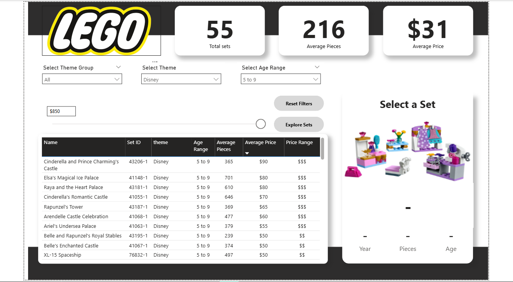
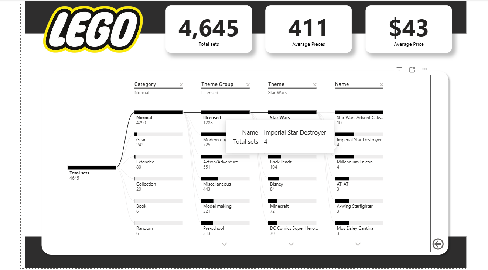

# LEGO Product Analytics Dashboard  
### Power BI | Data Modeling | Business Intelligence

---

## Executive Summary

This project transforms raw LEGO product data into an interactive business intelligence dashboard designed to simulate real-world retail analytics use cases.

The goal was not just to build visuals, but to create a decision-support system that helps analyze:

- Pricing strategy
- Product complexity
- Age segmentation
- Licensed vs Non-Licensed performance
- Portfolio diversity

The final solution demonstrates end-to-end BI workflow: data cleaning, feature engineering, modeling, DAX logic, and dashboard storytelling.

---

## Business Problem

Retail and toy manufacturing companies must answer:

- Which themes command premium pricing?
- Does piece count significantly influence price?
- Which age segments dominate the product portfolio?
- How strong is the licensed product segment?
- How diversified is the theme distribution?

This dashboard enables interactive exploration of these business questions.

---

## Dataset Overview

**Source:** Maven Analytics  
**Total Records:** 4,600+ LEGO sets  

### Key Fields:
- set_id
- name
- theme
- themeGroup
- age
- year
- pieces
- price
- image URL

---

## Data Cleaning & Transformation (Power Query)

### Data Type Standardization
- price → Decimal Number
- pieces → Whole Number
- age → Cleaned and standardized
- year → Whole Number

### Removed Invalid Records
Deleted rows containing:
- Missing age
- Null price
- Empty image URLs

### Feature Engineering (Conditional Columns)

#### Price Range Segmentation
- `$` → Budget
- `$$` → Mid-tier
- `$$$` → Premium

#### Age Range Segmentation
Grouped into strategic bands:
- 4–7
- 5–9
- 9–14
- 14+

These engineered features improved analytical filtering and segmentation.

---

## Data Modeling Strategy

- Cleaned master analytical table
- Parameter-driven filtering
- Slicer-based exploration
- Optimized DAX measures for dynamic reporting
- Designed for interactive drill-down experience

---

## DAX Measures (Analytical Logic)

### Core KPI Measures

```DAX
1. Average Age = AVERAGE(lego_sets[age])

2. Average Pieces = AVERAGE(lego_sets[pieces])

3. Average Price = AVERAGE(lego_sets[price])

4. Total Groups = DISTINCTCOUNT(lego_sets[themeGroup])

5. Total sets = DISTINCTCOUNT(lego_sets[set_id])

6. Dynamic Price Filter (Parameter-Based)
Max Price Filter = 
IF([Average Price] <= 'Max Price'[Max Price Value], 1, 0)

Used to dynamically filter visuals based on a user-controlled price ceiling parameter.

7. Dynamic Selection Display Measures
Selected Age = 
IF(
    HASONEVALUE(lego_sets[age]),
    MAX(lego_sets[age]),
    "-")

Selected Pieces = 
IF(
    HASONEVALUE(lego_sets[pieces]),
    MAX(lego_sets[pieces]),
    "-")

Selected Price = 
IF(
    HASONEVALUE(lego_sets[Price Range]),
    MAX(lego_sets[price]),
    "-")

Selected Year = 
IF(
    HASONEVALUE(lego_sets[year]),
    MAX(lego_sets[year]),
    "-")

These measures improve contextual awareness and enhance UX by dynamically reflecting user selections.

```
## Dashboard Capabilities
-- KPI Cards

Total Sets
Average Price
Average Pieces
Total Theme Groups

-- Advanced Filtering

Theme Group
Theme
Age Range
Price Range
Dynamic Max Price Parameter

-- Interactive Exploration

Drill-down navigation
Dynamic context display
Sortable product table
Cross-filtering across visuals

## Dashboard Screenshots
#### LEGO Set Finder


#### Set Explorer



## Key Business Insights

Licensed themes (e.g., Star Wars, Disney) show higher average pricing.
Piece count has strong correlation with price tier.
Age group 5–9 contains the highest number of sets.
Premium ($$$) pricing is concentrated within licensed theme groups.
Theme portfolio diversity varies significantly across categories.

## Business Impact Simulation

If deployed in a retail environment, this dashboard could support:
Pricing strategy optimization
Age-based product targeting
Licensed product performance analysis
Portfolio balancing decisions
Product segmentation strategy

## Tools & Technologies

Power BI
Power Query (ETL)
DAX
Data Modeling
Feature Engineering

## Skills Demonstrated

End-to-End BI Development
Data Cleaning & Transformation
DAX Measure Engineering
Analytical Thinking
Parameter-Based Filtering
KPI Design
Business Storytelling
Dashboard UX Optimization

## Author 
**Sumeet Patra** 
***Data Analyst | Power BI | SQL | Python***
